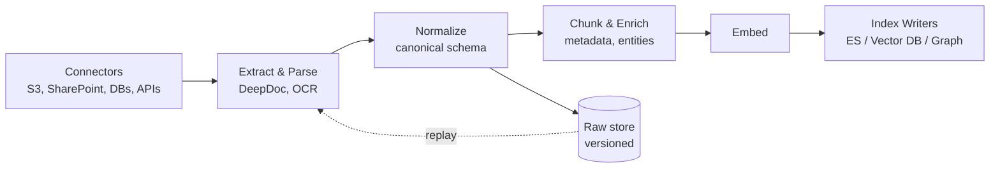
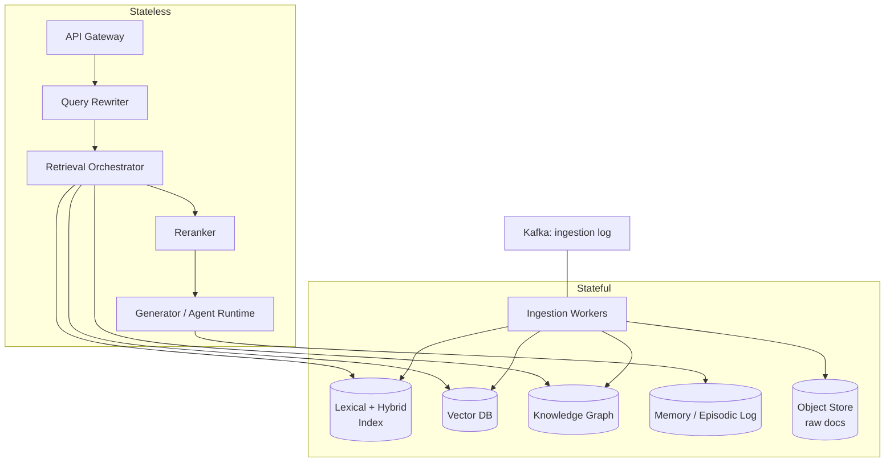

# Architectural Analysis of RAGFlow

**Assignment 4 — AI Spring 2026**

Kalp Patel

## 1. Deep document understanding vs naive chunking

Fixed-size chunking treats a document as a linear byte stream but Enterprise documents are not linear: they are layouts, multi-column PDFs, tables whose meaning depends on header rows, figures anchored to captions, sections whose semantics depend on hierarchical headings. Slicing such documents by token count destroys the structural signal that makes retrieval work. RAGFlow's DeepDoc engine instead parses documents into typed, structured elements before any chunking occurs.

**Retrieval fidelity.** A naive chunker routinely splits a table row from its header, orphans a caption from its figure, and fuses unrelated sections that happen to sit near a page boundary. Each of these produces chunks whose embedding does not represent any coherent proposition, which shows up as retrieval misses the reranker cannot rescue, the information simply is not in any single retrieved unit. Layout-aware parsing guarantees that a chunk corresponds to a semantically complete unit (a whole table with its header; a section with its heading), so the embedding actually summarizes a claim a user might query.

**Index design.** Deep parsing produces typed metadata like page number, section path, element type, table-cell coordinates these can be pushed into the index as structured fields. This enables metadata-filtered retrieval (type=table AND section~"Q3 results") and supports per-type rerankers (tables benefit from different scoring than prose). Naive chunking can only offer flat text fields and loses all of this leverage.

**Preprocessing cost.** Layout-aware parsing runs OCR, detects regions, and often calls vision models, making ingestion one to two orders of magnitude more expensive than split(text, 512). This is acceptable because ingestion is amortized. While retrieval is paid per query, for the lifetime of the system. Spending more at ingestion to avoid rerunning or regretting retrieval is a Pareto-dominant trade in almost every enterprise setting.

---

## 2. Chunking strategy: template vs semantic

Template-based chunking applies explicit, rule-driven segmentation (e.g., "split on `## ` headings", "one chunk per table row"). Embedding-driven semantic segmentation uses similarity between adjacent sentences or sliding windows to detect topic boundaries.

**Highly structured documents (financial reports, contracts, invoices).** Semantic chunking fails here. In a 10-K, adjacent sentences inside "Risk Factors" are all thematically similar, so the embedding-boundary detector finds no breaks and produces huge, undifferentiated chunks, or, it splits a numbered risk item in half because two clauses happened to drift. Template chunking wins: the document's own structure (Item 7A, Note 12, row-per-line-item) is a more reliable signal than any learned boundary.

**Loosely structured corpora.** Template chunking fails here because there is no template, speakers interleave, topics drift within a single turn, no heading grammar exists. Here the embedding signal is the only signal, and semantic segmentation correctly finds topic-shift boundaries that ignore turn boundaries.

The general principle: chunking strategy should match the strength of the document's explicit structure. RAGFlow exposing this as a configurable, per-knowledge-base choice is the right architectural call, baking in one strategy would force every corpus through the wrong mold.

---

## 3. Hybrid retrieval architecture

Lexical retrieval (BM25) scores on exact term overlap with length and IDF normalization. Dense retrieval scores on cosine similarity of learned embeddings. They fail on disjoint sets of queries, which is why their union beats either alone.

- **Lexical-only failure.** Query: *"How do I cancel my plan?"* Document: *"Subscription termination procedure."* Zero term overlap; BM25 returns nothing. Any paraphrase, synonym, or cross-lingual query exposes this.
- **Vector-only failure.** Query: *"error code E-4471 on device RX-220"*. Embedding models compress rare tokens, model numbers, error codes, SKUs, legal citations, gene names, into a narrow region of the space, so the exact document containing E-4471 is not meaningfully closer than a dozen other error-code pages. 
- **Hybrid edge case.** Simple score fusion (linear combination, or RRF) can still fail when BM25 and the dense retriever both agree but are both wrong in the same direction, e.g., a query whose key term is ambiguous (Java the language vs the island) and the corpus is dominated by one sense. Both signals concentrate on the majority sense; hybrid reinforces rather than corrects the bias. This is why RAGFlow adds a reranker as a third stage: a cross-encoder can read query and candidate jointly and demote the wrong-sense candidates that fusion alone preserved.

Formally, recall is bounded by recall(lexical ∪ dense) and hybrid approaches it; precision improves because the two signals act as independent votes, so candidates surfaced by both are much more likely to be relevant than candidates surfaced by either alone.

---

## 4. Multi-stage retrieval pipeline

A single-pass ANN search forces one index to simultaneously maximize recall and precision. These goals fight: high-recall indexes return noisy neighborhoods; high-precision scorers (cross-encoders) are too expensive to run over the whole corpus.

The pipeline candidate generation (k≈1000) → reranking (k≈20) → query refinement / agent loop decouples these objectives. Candidate generation runs cheap, high-recall retrievers (BM25 + ANN) over millions of chunks in tens of milliseconds. Reranking runs an expensive cross-encoder over only the candidates, quadratic cost, linear corpus scan avoided. Query refinement lets an agent observe what was retrieved and rewrite the query if the evidence is thin.

**Recall vs latency.** A single-stage system trying to hit cross-encoder precision over a full corpus is physically impossible at interactive latency. Multi-stage spends latency where it converts to quality: a 50 ms candidate stage plus a 150 ms rerank beats a 2 s single-stage scan and produces better top-k.

**Cascading errors.** The pipeline's weakness is that stage 1 is a hard filter: anything it drops is invisible to later stages. A reranker cannot rescue a document that candidate generation never retrieved. Mitigations: (i) keep k₁ generous, favor recall over precision in stage 1; (ii) use heterogeneous retrievers in stage 1 (BM25 + dense + metadata filter) so their failure modes are uncorrelated; (iii) let the agent loop rewrite the query and re-enter stage 1 when reranker scores are all low, converting what would be a silent miss into an additional retrieval round.

---

## 5. Indexing strategy and storage backends

Treating the index as just a database loses the workload-specific optimizations that make retrieval fast and cheap. RAGFlow's ability to swap between Elasticsearch and Infinity reflects that the right backend depends on the query mix.

| Backend | Strengths | Favored workloads |
|---|---|---|
| **Elasticsearch-like hybrid store** | Mature BM25, rich filters, aggregations, operational tooling | Text-heavy corpora with metadata filters, log analytics, workloads where lexical search is primary and vectors are auxiliary |
| **Vector-native DB (Infinity, Milvus, Qdrant)** | Purpose-built ANN (HNSW, IVF-PQ), tight memory layout, high QPS at low latency | Dense-first retrieval at large scale, embedding-centric pipelines, multimodal search where vectors dominate |
| **Graph-augmented store** | Typed edges, multi-hop traversal, provenance | Compositional queries ("drugs targeting proteins interacting with gene X"), entity-centric reasoning, explainability requirements |

**Design criteria.** Pick based on (1) query shape, lookup vs traversal vs similarity; (2) write pattern, bulk batch vs streaming updates; (3) recall/latency budget, cross-encoder reranking relaxes the ANN's recall target and lets you pick a smaller index; (4) operational surface, ES's tooling and ACLs are often decisive in enterprise settings even when a vector-native DB is technically faster; (5) memory footprint, Infinity's quantization wins when the corpus is too large to fit uncompressed HNSW graphs in RAM. The meta-point is that no single backend dominates, so the platform must treat the index as a pluggable component.

---

## 6. Query understanding and reformulation

Static query → retrieval assumes the user's phrasing is an adequate proxy for their intent. It rarely is. Users under-specify, use vocabulary that does not match the corpus ("cancel" vs "terminate"), or ask compound questions that no single passage can answer.

Query transformation attacks each failure: expansion adds synonyms and related terms to rescue lexical recall; decomposition splits "compare A and B on C" into separate sub-queries whose results are then fused; rewriting resolves pronouns and context from conversation history; HyDE-style hypothetical answers generate a fake ideal document and embed it, so the retriever searches in answer-space rather than question-space, which is closer to the embedded chunks.

**Static vs iterative.** Static rewriting runs once before retrieval, cheap, deterministic, but commits to a guess. Iterative refinement observes the retrieved evidence, notices when it is thin or contradictory, and rewrites. This converts retrieval from open-loop to closed-loop: the system's behavior is now a function of what it found, not only what was asked. The cost is latency and non-determinism. The right default is one static rewrite followed by at most one or two agent-driven refinement rounds, gated on reranker-score confidence so easy queries do not pay the loop cost.

---

## 7. Knowledge representation layer

| Representation         | Compositional reasoning                                                                                                                      | Explainability                                                                                                                |
| ---------------------- | -------------------------------------------------------------------------------------------------------------------------------------------- | ----------------------------------------------------------------------------------------------------------------------------- |
| **Dense vector space** | Poor, vectors compose by averaging, which conflates rather than conjoins; "drugs that treat X and interact with Y" is not a vector operation | Poor, a 1024-d cosine score is not an explanation; you can show the retrieved chunk but not why the embedding placed it there |
| **Relational schema**  | Strong within schema, SQL joins are literal composition, but brittle across schemas and unable to handle fuzzy or unseen predicates          | High, every answer traces to rows, and query plans are inspectable                                                            |
| **Knowledge graph**    | Strongest for multi-hop composition, typed edges make paths like drug→targets→protein→interacts→gene a first-class query                     | High, the path is the explanation, and can be shown to the user as a provenance chain                                         |

Vectors handle fuzzy, semantic matching that neither schema can express; graphs handle the compositional questions vectors cannot; relations handle the aggregation and filtering both struggle with. RAGFlow's GraphRAG support recognizes that these are complementary, not competing, a mature system uses vectors for recall, the graph for multi-hop and provenance, and metadata/relational filters as a pre-filter to narrow the space for the other two.

---

## 8. Data ingestion pipeline architecture

A robust ingestion pipeline treats each source as an independent stream feeding a shared, canonical knowledge representation.

**Schema normalization.** Every source emits a document in a canonical internal form before any downstream stage sees it. This decouples the N source connectors from the M downstream indexers, turning an N×M integration problem into N+M.

**Incremental indexing.** The pipeline must support change data capture: detect which documents changed since the last run (content hash or source timestamp), re-parse only those, and issue upserts rather than full rebuilds. Deletions propagate via tombstones. Without this, a 10M-document corpus cannot be kept fresh.

**Consistency vs throughput.** Synchronous, strongly-consistent indexing (write to ES, vector DB, and graph in one transaction) caps throughput at the slowest backend and makes any single failure a full stop. The production-grade pattern is a durable log (Kafka or equivalent) between "parsed + chunked" and the index writers, with each writer as an independent consumer. Writers can be async and eventually consistent; the log is the source of truth; failures in one index do not block the others; and replay is a matter of resetting a consumer offset. The user-visible cost is a short window of staleness, which is almost always acceptable.

---

## 9. Memory design in RAG systems

Memory is what lets a RAG agent stop treating each turn as a cold start. Three architectures trade different things:

- **Vector memory (semantic recall).** Past turns, observations, or documents are embedded and queried by similarity. Great for "have we seen something like this before?" Poor at temporal reasoning "what did we decide last week?" and at exact-match recall of identifiers.
- **Structured memory (SQL / graph).** Facts are stored as typed rows or triples: `user.preferred_language = 'es'`, `user→owns→ticket(#4471)`. Exact, queryable, updatable, explainable. Poor at fuzzy recall, you cannot ask it to "remind me about that frustrating bug from a few weeks ago" because it was never written as a row.
- **Episodic logs (temporal traces).** Append-only sequence of (timestamp, turn, action, result). Preserves order and causality, which the other two discard. Expensive to search directly, but indispensable for "what happened and when" and for replaying agent trajectories for debugging or training.

A production memory layer uses all three: the episodic log is the durable substrate, the vector store is a recall index built over it, and the structured store is a projection of extracted facts. Writes go to the log; reads go to whichever index matches the query shape. This mirrors the ingestion story, canonical source of truth, multiple specialized indexes built on top, which is not a coincidence.

---

## 10. End-to-end system decomposition

A microservices decomposition for a RAGFlow-like platform should draw service boundaries along *workload shape* and *state*, not along entities.

**Stateless services** (API gateway, query rewriter, retrieval orchestrator, reranker, generator/agent runtime) scale horizontally on CPU/GPU demand. They hold no data between requests, so they can be replicated freely and replaced on failure with no coordination. Rerankers and generators are GPU-bound and scale independently from the CPU-bound orchestrator, fusing them would waste one or the other.

**Stateful services** (document stores, vector DB, graph, memory store, object store) scale via sharding and replication, not replication alone. Their scaling cadence is slow and driven by data growth, not query load, which is why they must be separated from the stateless tier co-locating them couples two very different scaling rhythms.

**Ingestion** is isolated behind a durable log (Kafka). This is the single most important failure-isolation boundary in the system: a parser crash, a poisoned document, or a slow vector-DB write cannot back-pressure into the user-facing query path, because ingestion and serving share no synchronous path. They share only the indexes, and those are eventually consistent.

**Failure isolation boundaries.** (1) Ingestion vs serving via the log. (2) Retrieval vs generation, the orchestrator returns whatever it found within a latency budget; the generator degrades to a "no evidence" answer rather than hanging. (3) Per-backend  retrieval orchestrator queries ES, vector DB, and graph in parallel with independent timeouts; any one going down degrades quality but does not take the system down. (4) Per-tenant in multi-tenant deployments, noisy-neighbor isolation via rate limits and per-tenant quotas at the gateway.

**Scaling strategy summary.** Stateless tier: HPA on request rate and GPU utilization. Index tier: shard by document id, replicate for read throughput, scale on storage and query latency. Ingestion workers: scale on Kafka consumer lag. Memory store: partitioned by user/session, scale on active sessions. The decomposition is ultimately a bet that the platform's dominant axis of change is load, not features  and services that scale along different axes must live in different processes.

